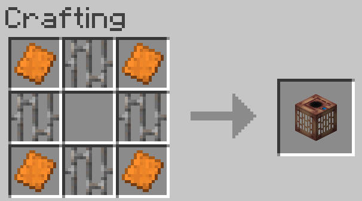
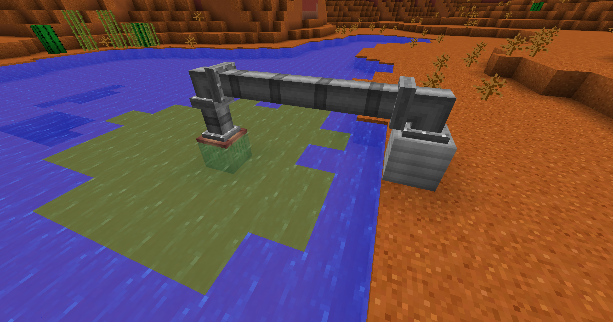

# UnecologicalMethods

## Overview

The mod itself only adds one block which is visually similar to the Fluid Outlet. It must be in contact with any form of water on all sides besides top and bottom. The input is on the top, and it only pollutes the water blocks on the same Y level as itself. If a water block has another clean water block above it, it cannot be polluted. Any entity that enters in contact with the polluted water gains some negative effects. The polluted water cannot be used to moisturize farmland.

## Recipe

## Example

## Config
By default: a water block is polluted per 2000 mb of liquid, the drain has infinite range, the drain updates every 20 ticks. If you wish to change those or more, I heavily advise to look into "config/unecologicalmethods.cfg".
